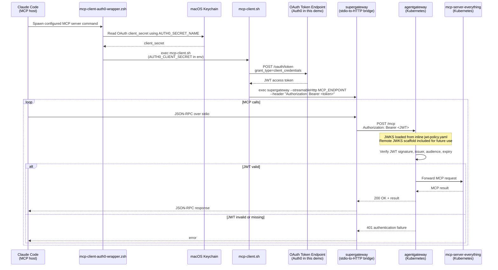

# MCP on Kubernetes with agentgateway + JWT Auth

This project demonstrates a local, MCP (Model Context Protocol) security pattern:

> Protect an MCP server behind **agentgateway**, require a valid OAuth/JWT access token, and keep the OAuth client secret out of the MCP host configuration file.

This demo uses **Auth0** as the OAuth 2.0/OIDC authorization server, but the pattern is vendor-neutral. Any authorization server or identity provider that supports the OAuth 2.0 client credentials grant and publishes signing keys through a JWKS endpoint can be used.

### Tested on
:apple: `MacOS`

In this setup:

- An MCP server (`@modelcontextprotocol/server-everything`) runs inside a local **minikube** Kubernetes cluster.
- **agentgateway** acts as an MCP-aware gateway in front of the server.
- **Claude Code** acts as the MCP host.
- A local wrapper script retrieves the OAuth client secret from the **macOS Keychain** at runtime.
- The MCP launcher exchanges the client credentials for a short-lived JWT access token from the authorization server.
- **supergateway** bridges Claude Code's stdio MCP connection to the HTTP MCP endpoint exposed through agentgateway.
- agentgateway validates the JWT before forwarding MCP traffic to the backend MCP server.

The result: the MCP server is not directly exposed as an unauthenticated tool endpoint. Requests must pass through the gateway with a valid bearer token before reaching the MCP server.

> This is a headless machine-to-machine pattern. It authenticates the MCP host/application, not an individual end user.

---

## What This Demonstrates

This project is useful for learning how to:

- Put a gateway enforcement point in front of an MCP server.
- Use OAuth 2.0 client credentials for headless MCP access.
- Use a standards-based token endpoint to obtain a JWT access token.
- Obtain a JWKS set and use as the source of public signing keys for JWT validation.
- Validate JWTs at agentgateway before proxying MCP traffic.
- Keep client secrets out of `.mcp.json` by retrieving them from macOS Keychain at runtime.
- Run an HTTP-based MCP server behind Kubernetes Gateway API resources.
- Bridge a local stdio MCP host to an HTTP MCP endpoint using `supergateway`.

## Identity Provider Requirements

Auth0 is used in this repo because it is easy to set up for a local demo. It is not required by the pattern.

The identity provider or authorization server needs to provide:

- An **OAuth 2.0 token endpoint** that supports the `client_credentials` grant.
- A **JWT access token** issued for the MCP gateway audience.
- A **JWKS endpoint** that publishes the public signing keys used to validate the JWT.
- Stable `issuer` and `audience` values that agentgateway can validate.

Examples of suitable providers include Auth0, Microsoft Entra ID, Okta, Keycloak, Ping Identity, or another OAuth 2.0/OIDC-compatible authorization server.

> The environment variable names in this repo use `AUTH0_*` because the demo was built with Auth0. For another provider, you can either reuse those variable names or rename them to something more generic, such as `OIDC_DOMAIN`, `OAUTH_CLIENT_ID`, and `OAUTH_AUDIENCE`.

## What This Does Not Demonstrate

This is intentionally scoped. It does **not** demonstrate:

- Per-user delegated authorization.
- User identity passthrough.
- End-user consent flows.
- Production-grade secret rotation.
- Enterprise managed identity or workload identity.
- Full MCP policy enforcement, such as per-tool authorization or data loss prevention.
- Remote JWKS fetching in agentgateway v1.1.0 for an external HTTPS JWKS endpoint over an ExternalName Service.

For production, prefer workload identity, managed identity, or `private_key_jwt` where possible instead of a long-lived client secret.

---

## Architecture



---

## Prerequisites

| Tool           | Version used                          | Install                                  |
| -------------- | ------------------------------------- | ---------------------------------------- |
| Docker Desktop | 28.x+                                 | https://docs.docker.com/get-docker/      |
| minikube       | 1.38.x+                               | https://minikube.sigs.k8s.io/docs/start/ |
| kubectl        | 1.36.x+                               | https://kubernetes.io/docs/tasks/tools/  |
| helm           | 4.x+                                  | https://helm.sh/docs/intro/install/      |
| Node.js + npx  | 22.x+                                 | https://nodejs.org/                      |
| jq             | current                               | `brew install jq`                        |
| Auth0 account  | free tier is sufficient for this demo | https://auth0.com                        |

> **macOS only:** this repo stores the OAuth client secret in the macOS Keychain. The wrapper script uses the `security` CLI, which ships with macOS.

---

## Project Structure

```text
.
|-- README.md
|-- .mcp.json                            # Claude Code MCP server config
|-- config/
|   `-- claude_desktop_config.json       # Claude Desktop MCP config, no-auth variant
|-- scripts/
|   |-- mcp-client-auth0-wrapper.zsh     # Reads secret from Keychain, execs mcp-client.sh
|   |-- mcp-client.sh                    # Fetches Auth0 JWT, launches supergateway
|   |-- New-JwtPolicyYaml.ps1            # Generates jwt-policy.yaml from live JWKS (PowerShell)
|   |-- new_jwt_policy_yaml.py           # Generates jwt-policy.yaml from live JWKS (Python)
|   `-- security_testing/
|       `-- Test-JwtPolicy.ps1           # JWT policy test suite (PowerShell)
`-- k8s/
    |-- mcp-server/
    |   |-- deployment.yaml              # MCP server pod using node:22-alpine + mcp-proxy
    |   `-- service.yaml                 # ClusterIP with appProtocol: agentgateway.dev/mcp
    `-- agentgateway/
        |-- gateway.yaml                 # Gateway listener on port 80
        |-- backend.yaml                 # AgentgatewayBackend selecting the MCP service
        |-- httproute.yaml               # HTTPRoute wiring Gateway -> Backend
        |-- jwt-policy.yaml              # AgentgatewayPolicy enforcing JWT in Strict mode
        `-- auth0-jwks-service.yaml      # ExternalName Service scaffold for future remote JWKS use
```

---

## Step 1 - Identity Provider Setup (Auth0 Example)

This demo uses Auth0 as the authorization server. The same pattern works with any OAuth 2.0/OIDC-compatible provider that can issue JWT access tokens and publish signing keys through JWKS.

For a different provider, create the equivalent of:

- a protected API/resource representing the MCP gateway audience
- a machine-to-machine OAuth client
- a token endpoint that supports `client_credentials`
- a JWKS endpoint for JWT signature validation

### 1.1 Create an API

In the Auth0 dashboard, create a new **API**:

| Field                 | Value                 |
| --------------------- | --------------------- |
| Name                  | `MCP Gateway`         |
| Identifier / Audience | `https://mcp.gateway` |
| Signing Algorithm     | RS256                 |

### 1.2 Create a Machine-to-Machine Application

Create a new **Machine to Machine** application and authorize it against the API you just created.

Note down:

- **Domain** - for example, `your-tenant.us.auth0.com`
- **Client ID**
- **Client Secret**

### 1.3 Generate jwt-policy.yaml

agentgateway v1.1.0 does not support pointing its JWT policy at a remote JWKS URI or an OpenID Connect well-known configuration URI. It cannot fetch public keys from `https://idp.example.com/.well-known/jwks.json` or `/.well-known/openid-configuration` at runtime. The signing keys must be embedded directly in the `jwt-policy.yaml` manifest under `jwks.inline`.

This means you cannot simply reference your identity provider's JWKS endpoint in the policy. You must fetch the keys yourself and embed them in the manifest. Two scripts are provided to automate exactly that: each one fetches the public keys from your identity provider, constructs the full `AgentgatewayPolicy` manifest, and writes it to disk. Run the script once to generate the file, then re-run it whenever your identity provider rotates its signing keys.

Use whichever script fits your environment — they produce identical output.

#### PowerShell — `scripts/New-JwtPolicyYaml.ps1`

Requires the `powershell-yaml` and `PSJsonWebToken` modules:

```powershell
Install-Module powershell-yaml, PSJsonWebToken
```

Dot-source the file to load the function, then call it:

```powershell
. ./scripts/New-JwtPolicyYaml.ps1

New-JwtPolicyYaml `
    -Uri      "https://<your-domain>/.well-known/openid-configuration" `
    -Issuer   "https://<your-domain>/" `
    -Audiences "https://mcp.gateway" `
    -OutputPath ./k8s/agentgateway/jwt-policy.yaml
```

`-Uri` accepts either a direct JWK Set URI (`.well-known/jwks.json`) or an OpenID Connect discovery document (`.well-known/openid-configuration`). The function resolves `jwks_uri` automatically when the discovery document form is used.

#### Python — `scripts/new_jwt_policy_yaml.py`

Requires Python 3 and PyYAML:

```bash
pip install pyyaml
```

```bash
python3 scripts/new_jwt_policy_yaml.py \
    --uri      "https://<your-domain>/.well-known/openid-configuration" \
    --issuer   "https://<your-domain>/" \
    --audiences "https://mcp.gateway" \
    --output-path ./k8s/agentgateway/jwt-policy.yaml
```

Like the PowerShell version, `--uri` accepts either a JWKS URI or an OpenID Connect discovery document and follows `jwks_uri` automatically.

The generated file is applied to the cluster in Step 5.

---

## Step 2 - Store the Client Secret in macOS Keychain

The OAuth client secret is **not stored in `.mcp.json`**. The wrapper script retrieves it at runtime using the macOS `security` CLI.

Run this once:

```bash
security add-generic-password \
  -a "$USER" \
  -s <your-secret-name> \
  -w "YOUR_CLIENT_SECRET_HERE" \
  -U
```

- `-s` sets the service name. This must match `AUTH0_SECRET_NAME` in `.mcp.json`.
- `-a` sets the account to your macOS username.
- `-w` sets the secret value.
- `-U` updates the existing Keychain item if it already exists.

To verify it was stored:

```bash
security find-generic-password \
  -a "$USER" \
  -s <your-secret-name> \
  -w
```

---

## Step 3 - Start minikube

```bash
minikube start --driver=docker --cpus=4 --memory=4096
```

---

## Step 4 - Install agentgateway

```bash
# Kubernetes Gateway API CRDs
kubectl apply --server-side \
  -f https://github.com/kubernetes-sigs/gateway-api/releases/download/v1.5.0/standard-install.yaml

# agentgateway CRDs
helm upgrade -i --create-namespace \
  --namespace agentgateway-system \
  --version v1.1.0 \
  agentgateway-crds oci://cr.agentgateway.dev/charts/agentgateway-crds

# agentgateway control plane
helm upgrade -i \
  -n agentgateway-system \
  --version v1.1.0 \
  agentgateway oci://cr.agentgateway.dev/charts/agentgateway

# Verify all pods reach Running
kubectl get pods -n agentgateway-system
```

---

## Step 5 - Apply Kubernetes Manifests

### 5.1 MCP Server Deployment

`k8s/mcp-server/deployment.yaml` runs the reference MCP server inside the cluster using `mcp-proxy` to expose it over HTTP:

```yaml
apiVersion: apps/v1
kind: Deployment
metadata:
  name: mcp-server-everything
  namespace: agentgateway-system
spec:
  replicas: 1
  selector:
    matchLabels:
      app: mcp-server-everything
  template:
    metadata:
      labels:
        app: mcp-server-everything
    spec:
      containers:
      - name: mcp-server
        image: node:22-alpine
        command: ["npx", "-y", "mcp-proxy", "--port", "8080", "--", "npx", "-y", "@modelcontextprotocol/server-everything"]
        ports:
        - containerPort: 8080
```

`k8s/mcp-server/service.yaml` exposes it as a ClusterIP Service. The `appProtocol: agentgateway.dev/mcp` value identifies the Service as an MCP endpoint for agentgateway:

```yaml
apiVersion: v1
kind: Service
metadata:
  name: mcp-server-everything
  namespace: agentgateway-system
  labels:
    app: mcp-server-everything
spec:
  selector:
    app: mcp-server-everything
  ports:
  - port: 80
    targetPort: 8080
    appProtocol: agentgateway.dev/mcp
```

### 5.2 agentgateway Resources

`k8s/agentgateway/gateway.yaml` - HTTP listener on port 80:

```yaml
apiVersion: gateway.networking.k8s.io/v1
kind: Gateway
metadata:
  name: agentgateway-proxy
  namespace: agentgateway-system
spec:
  gatewayClassName: agentgateway
  listeners:
  - protocol: HTTP
    port: 80
    name: http
    allowedRoutes:
      namespaces:
        from: All
```

`k8s/agentgateway/backend.yaml` - selects the MCP service by metadata label:

```yaml
apiVersion: agentgateway.dev/v1alpha1
kind: AgentgatewayBackend
metadata:
  name: mcp-backend
  namespace: agentgateway-system
spec:
  mcp:
    targets:
    - name: mcp-server-everything
      selector:
        services:
          matchLabels:
            app: mcp-server-everything
```

`k8s/agentgateway/httproute.yaml` - routes traffic through the gateway to the MCP backend:

```yaml
apiVersion: gateway.networking.k8s.io/v1
kind: HTTPRoute
metadata:
  name: mcp
  namespace: agentgateway-system
spec:
  parentRefs:
  - name: agentgateway-proxy
    namespace: agentgateway-system
  rules:
  - backendRefs:
    - name: mcp-backend
      namespace: agentgateway-system
      group: agentgateway.dev
      kind: AgentgatewayBackend
```

`k8s/agentgateway/jwt-policy.yaml` - enforces JWT authentication in **Strict** mode with inline JWKS. This file is generated by the script in Step 1.3.

`k8s/agentgateway/auth0-jwks-service.yaml` - scaffold for remote JWKS, not active in the current configuration. The file name uses Auth0 because this demo uses Auth0, but the concept applies to any external JWKS endpoint:

```yaml
apiVersion: v1
kind: Service
metadata:
  name: auth0-jwks
  namespace: agentgateway-system
spec:
  type: ExternalName
  externalName: <your-tenant>.us.auth0.com
  ports:
  - port: 443
    targetPort: 443
```

Apply all manifests:

```bash
kubectl apply -f k8s/mcp-server/
kubectl apply -f k8s/agentgateway/

kubectl rollout status deployment/mcp-server-everything \
  -n agentgateway-system
```

---

## Step 6 - Expose agentgateway Locally

Run this in a dedicated terminal and keep it open for the duration of your session:

```bash
kubectl port-forward deployment/agentgateway-proxy \
  -n agentgateway-system 8080:80
```

The MCP endpoint is now reachable locally at:

```text
http://localhost:8080/mcp
```

---

## Step 7 - Configure the MCP Host

### Claude Code

`.mcp.json` configures Claude Code to launch the OAuth wrapper as the MCP server command.

Fill in your provider values. Do **not** put the client secret in this file. The example variable names use `AUTH0_*` because this demo uses Auth0.

```json
{
  "mcpServers": {
    "everything": {
      "command": "/path/to/scripts/mcp-client-auth0-wrapper.zsh",
      "env": {
        "AUTH0_DOMAIN": "<your-tenant>.us.auth0.com",
        "AUTH0_CLIENT_ID": "<your-client-id>",
        "AUTH0_AUDIENCE": "https://mcp.gateway",
        "AUTH0_SECRET_NAME": "<your-secret-name>",
        "MCP_ENDPOINT": "http://localhost:8080/mcp"
      }
    }
  }
}
```

### Claude Desktop, no-auth variant

`config/claude_desktop_config.json` is a simpler Claude Desktop config that skips Auth0. Use this only while JWT policy is disabled or before applying the JWT policy.

```json
{
  "mcpServers": {
    "everything": {
      "command": "npx",
      "args": ["-y", "supergateway", "--streamableHttp", "http://localhost:8080/mcp"]
    }
  }
}
```

Copy this file to:

```text
~/Library/Application Support/Claude/claude_desktop_config.json
```

Then fully quit and relaunch Claude Desktop.

---

## How the Auth Flow Works

The auth launcher uses two scripts.

### `scripts/mcp-client-auth0-wrapper.zsh`

This script retrieves the OAuth client secret from macOS Keychain and then execs the next stage.

```zsh
#!/bin/zsh
emulate -L zsh
set -euo pipefail

: "${AUTH0_DOMAIN:?Missing AUTH0_DOMAIN}"
: "${AUTH0_CLIENT_ID:?Missing AUTH0_CLIENT_ID}"
: "${AUTH0_AUDIENCE:?Missing AUTH0_AUDIENCE}"
: "${MCP_ENDPOINT:?Missing MCP_ENDPOINT}"
: "${AUTH0_SECRET_NAME:?Missing AUTH0_SECRET_NAME}"

AUTH0_CLIENT_SECRET="$(
  security find-generic-password \
    -a "$USER" \
    -s "$AUTH0_SECRET_NAME" \
    -w
)"

export AUTH0_CLIENT_SECRET

exec /path/to/scripts/mcp-client.sh
```

### `scripts/mcp-client.sh`

This script exchanges the client credentials for a short-lived JWT access token, then starts `supergateway`.

```bash
#!/bin/bash
set -euo pipefail

TOKEN="$(curl -sf -X POST "https://${AUTH0_DOMAIN}/oauth/token" \
  -H "Content-Type: application/x-www-form-urlencoded" \
  -d "grant_type=client_credentials&client_id=${AUTH0_CLIENT_ID}&client_secret=${AUTH0_CLIENT_SECRET}&audience=${AUTH0_AUDIENCE}" \
  | jq -r .access_token)"

exec npx -y supergateway \
  --streamableHttp "${MCP_ENDPOINT}" \
  --header "Authorization: Bearer ${TOKEN}"
```

> The token is acquired when the MCP process starts. For long-running sessions, add token renewal logic or restart the MCP process when the token expires.

---

## Step 8 - Validate

### 8.1 Confirm a valid token is accepted

Fetch a token from the authorization server and use it in a request. This example uses Auth0:

```bash
TOKEN="$(curl -sf -X POST "https://<your-domain>/oauth/token" \
  -H "Content-Type: application/x-www-form-urlencoded" \
  -d "grant_type=client_credentials&client_id=<your-client-id>&client_secret=<your-client-secret>&audience=https://mcp.gateway" \
  | jq -r .access_token)"

curl -s -X POST http://localhost:8080/mcp \
  -H "Content-Type: application/json" \
  -H "Accept: application/json, text/event-stream" \
  -H "Authorization: Bearer ${TOKEN}" \
  -d '{"jsonrpc":"2.0","id":1,"method":"initialize","params":{"protocolVersion":"2024-11-05","capabilities":{},"clientInfo":{"name":"test","version":"1.0"}}}'
```

Expected result:

- HTTP `200`
- an `Mcp-Session-Id` response header
- an MCP initialize result
- no `authentication failure` in the body

### 8.2 Confirm a bad token is rejected

Malformed JWT:

```bash
curl -s -X POST http://localhost:8080/mcp \
  -H "Content-Type: application/json" \
  -H "Authorization: Bearer invalid.jwt.token" \
  -d '{"jsonrpc":"2.0","id":1,"method":"tools/call","params":{"name":"echo","arguments":{"message":"test"}}}'
```

Expected:

```text
authentication failure: the token header is malformed
```

Structurally valid JWT with unknown key ID:

```bash
HEADER="$(echo -n '{"alg":"RS256","typ":"JWT","kid":"fake-key-id"}' | base64 | tr '+/' '-_' | tr -d '=')"
PAYLOAD="$(echo -n '{"sub":"test","iss":"https://<your-domain>/","aud":"https://mcp.gateway","exp":9999999999}' | base64 | tr '+/' '-_' | tr -d '=')"
SIG="ZmFrZXNpZ25hdHVyZQ"

curl -s -X POST http://localhost:8080/mcp \
  -H "Content-Type: application/json" \
  -H "Authorization: Bearer ${HEADER}.${PAYLOAD}.${SIG}" \
  -d '{"jsonrpc":"2.0","id":1,"method":"tools/call","params":{"name":"echo","arguments":{"message":"test"}}}'
```

Expected:

```text
authentication failure: token uses the unknown key "fake-key-id"
```

### 8.3 Automated JWT policy tests

`scripts/security_testing/Test-JwtPolicy.ps1` exercises the gateway's JWT enforcement with a structured test matrix. It requires the `PSJsonWebToken` module and a running agentgateway reachable at `http://localhost:8080`.

```powershell
Install-Module PSJsonWebToken
```

Set environment variables for your Auth0 tenant (or pass them as parameters):

```powershell
$env:AUTH0_DOMAIN        = '<your-domain>'
$env:AUTH0_CLIENT_ID     = '<your-client-id>'
$env:AUTH0_CLIENT_SECRET = '<your-client-secret>'
$env:AUTH0_AUDIENCE      = 'https://mcp.gateway'
```

Run the suite:

```powershell
./scripts/security_testing/Test-JwtPolicy.ps1
```

Test matrix:

| # | Scenario                       | Expected |
|---|--------------------------------|----------|
| 1 | No Authorization header        | 401      |
| 2 | Garbage token                  | 401      |
| 3 | HS256 token (algorithm confusion) | 401   |
| 4 | Expired JWT                    | 401      |
| 5 | Wrong audience                 | 401      |
| 6 | Wrong issuer                   | 401      |
| 7 | Valid Auth0 JWT                | 2xx      |

The script prints colored pass/fail output for each case and exits with a non-zero code if any test fails, making it suitable for use in a CI pipeline.

If `AUTH0_DOMAIN`, `AUTH0_CLIENT_ID`, or `AUTH0_CLIENT_SECRET` are not set, the live-token tests (cases 1–6 still run using locally constructed tokens; case 7 is skipped).

---

## Security Notes

This repo demonstrates a useful gateway pattern, but there are important boundaries:

- **Client credentials is application identity.** The gateway authenticates the MCP host/application, not the individual user.
- **The client secret still exists at runtime.** Keychain keeps it out of `.mcp.json` and out of the repo, but the wrapper exports it to the child process so `mcp-client.sh` can request a token.
- **The JWT should be short-lived.** Do not rely on a long-lived bearer token.
- **Validate audience and issuer.** The token should be issued by the expected authorization server and intended for the MCP gateway audience.
- **Do not expose this over plain HTTP in production.** This demo uses local `kubectl port-forward` and `localhost`.
- **Add policy for real use.** JWT validation is only the first layer. Real deployments should also consider per-client authorization, per-tool authorization, logging, rate limiting, egress controls, and data handling policies.

---

## Troubleshooting

### `mcp: no backends configured`

The `AgentgatewayBackend` selector matches Service **metadata labels**, not just `spec.selector`.

Verify the Service has the expected label:

```bash
kubectl get svc mcp-server-everything \
  -n agentgateway-system \
  --show-labels
```

### MCP server pod not starting

```bash
kubectl describe pod -l app=mcp-server-everything \
  -n agentgateway-system

kubectl logs deployment/mcp-server-everything \
  -n agentgateway-system
```

### Keychain secret not found

```bash
security find-generic-password \
  -a "$USER" \
  -s <your-secret-name> \
  -w
```

If it returns nothing, repeat Step 2.

### Port already in use

```bash
lsof -ti:8080 | xargs kill
```

### Teardown

```bash
helm uninstall agentgateway agentgateway-crds \
  -n agentgateway-system

kubectl delete namespace agentgateway-system

minikube delete
```
